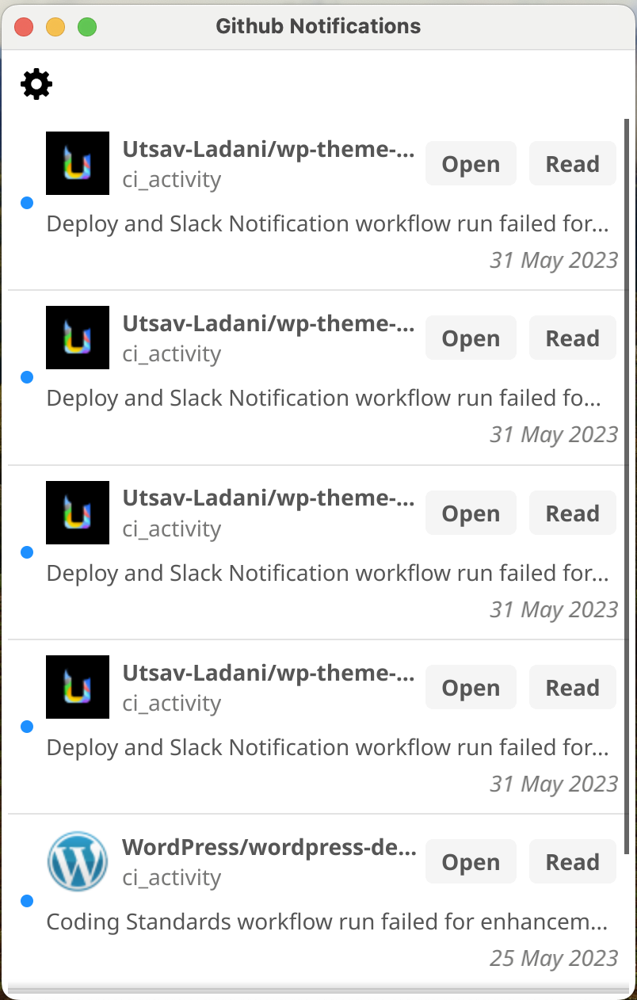
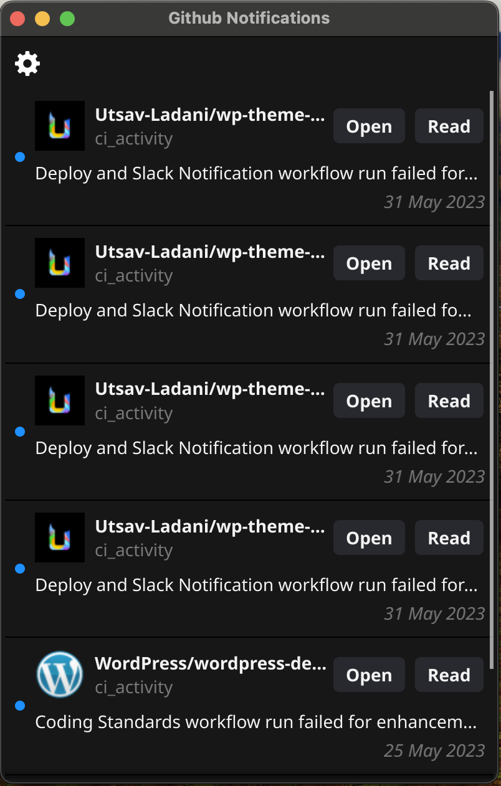

## GitHub Notifier
It notifies you on the desktop when you get a notification on GitHub. GitHub didn't provide a push notification service for a desktop device, so I made this.

## How to build
1. Download the latest code from the `main` branch.
2. Install the `go` compiler.
3. Run `go get .` to install dependencies.
4. Install fyne using `go install fyne.io/fyne/v2/cmd/fyne@latest`.
5. Run `fyne install` to install the app into your system.
6. 🎉 Done!

## How to use
1. Run the app.
2. You can add the app to your startup program list.
3. 🎉 Done!

## How to contribute
1. Fork this repo.
2. Make changes.
3. Make a pull request.
4. 🎉 Done!
